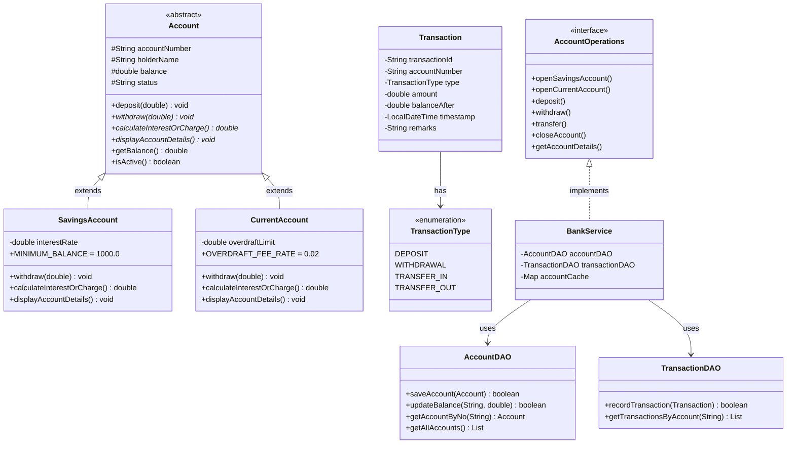
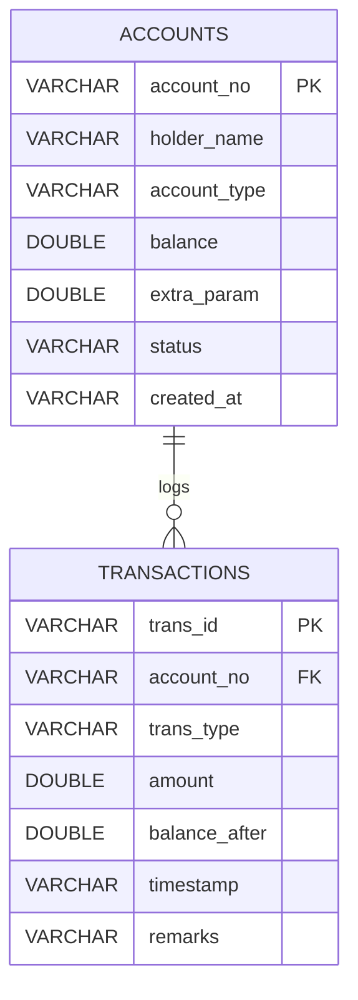
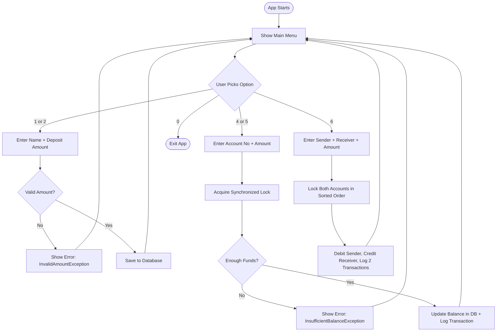

# PROJECT REPORT

## Bank Account Management System (BAMS)

**Course:** Programming in Java  
**Student Name:** Ankit Pathak  
**Institution:** VIT, School of Computer Science and Engineering  
**Year:** 2nd Year B.Tech  

---

## 1. Introduction

The **Bank Account Management System (BAMS)** is a Java-based console application that simulates basic banking operations like opening accounts, doing transactions, and viewing history.

The project was built to cover all major Java topics taught in the 2nd year:
- OOP concepts (classes, inheritance, polymorphism, interfaces)
- Exception handling (custom exceptions, try-catch)
- Multithreading and synchronization
- Collections framework (List, Map)
- JDBC for database connectivity

All data is saved to a SQLite database, so nothing is lost even after closing the app.

---

## 2. Problem Statement

Manual banking systems are slow and error-prone. This project addresses three main problems:

1. **Different rules for different accounts** — Savings accounts need a minimum balance of Rs.1000. Current accounts allow going below zero (overdraft). A generic system can't handle this properly.

2. **Data gets lost** — Without a database, all account info disappears when the app closes.

3. **Concurrent access issues** — If two operations happen on the same account at the same time (e.g., two withdrawals), the balance could get corrupted without proper synchronization.

BAMS solves all three using OOP design, JDBC persistence, and synchronized methods.

---

## 3. Features

| Option | Feature |
|--------|---------|
| 1 | Open Savings Account (min Rs.1000, earns interest) |
| 2 | Open Current Account (overdraft facility) |
| 3 | View Account Details |
| 4 | Deposit Money |
| 5 | Withdraw Money |
| 6 | Transfer Between Accounts |
| 7 | View Transaction History (Passbook) |
| 8 | Close an Account |
| 9 | List All Accounts |
| 0 | Exit |

---

## 4. System Architecture

The project is split into clean layers so each part has one job:

```
BankApp (UI / Menu)
    ↓
BankService (Business Logic)
    ↓              ↓
AccountDAO      TransactionDAO     (Database layer via JDBC)
    ↓              ↓
        SQLite Database (bank.db)

Models: Account, SavingsAccount, CurrentAccount, Transaction
Exceptions: AccountNotFoundException, InsufficientBalanceException, etc.
Utils: ConsoleUtils (input handling)
```

---

## 5. Class Diagram



---

## 6. Database Design (ER Diagram)



The `extra_param` column stores interest rate for savings accounts and overdraft limit for current accounts.

---

## 7. Flow Diagram



---

## 8. Key Design Decisions

### 1. Abstract Class + Inheritance
Instead of having one Account class with `if-else` conditions for savings vs current, we use inheritance:
- `Account` (abstract) defines the common structure
- `SavingsAccount` overrides `withdraw()` to enforce the Rs.1000 minimum balance rule
- `CurrentAccount` overrides `withdraw()` to allow overdraft spending

This makes the code cleaner and easier to extend later.

### 2. Custom Exceptions
Instead of printing generic error messages, we throw specific custom exceptions:
- `InvalidAmountException` → when amount is zero or negative
- `InsufficientBalanceException` → when balance is too low
- `AccountNotFoundException` → when account number doesn't exist
- `OverdraftLimitExceededException` → extends `InsufficientBalanceException`, for current accounts

This makes error handling precise and helpful.

### 3. Thread Safety (synchronized)
The `deposit()` and `withdraw()` methods in `Account` are marked `synchronized`. This means if two threads try to modify the same account at the same time, one has to wait. This prevents the balance from getting corrupted.

For transfers between two accounts, we always lock the accounts in the same order (by account number) to prevent deadlock.

### 4. SQLite Database via JDBC
We use SQLite because it doesn't need any installation or server setup — the database is just a file (`bank.db`). This makes the project easy to run anywhere. We use `PreparedStatement` for all queries to prevent SQL injection.

### 5. In-Memory Cache
`BankService` keeps a `ConcurrentHashMap<String, Account>` in memory. When you look up an account, it checks the cache first before hitting the database. This makes repeated lookups much faster.

---

## 9. Sample Output

### Opening a Savings Account
```
================================================================================
                         OPEN SAVINGS ACCOUNT
================================================================================
Enter your full name: Ankit Pathak
Enter opening deposit (min Rs. 1000.0): Rs. 500
Amount must be at least Rs. 1000.00. Try again: Rs. 15000
Enter annual interest rate (%): 4.5

[SUCCESS] Savings account created successfully!
------------------------------------------------------------
              SAVINGS ACCOUNT DETAILS
------------------------------------------------------------
  Account Number      : SB1001
  Account Holder      : Ankit Pathak
  Account Type        : SAVINGS
  Current Balance     : Rs. 15000.00
  Min Balance Required: Rs. 1000.00
  Annual Interest Rate: 4.50%
  Estimated Interest  : Rs. 675.00 per year
  Status              : ACTIVE
  Account Opened On   : 2026-09-17 19:00:00
------------------------------------------------------------
```

### Viewing Transaction History
```
================================================================================
                    TRANSACTION HISTORY (PASSBOOK)
================================================================================
Account: SB1001 | Holder: Ankit Pathak | Balance: Rs. 15000.00
--------------------------------------------------------------------------------
Date & Time          | Txn ID       | Type           |     Amount |    Balance | Note
--------------------------------------------------------------------------------
2026-09-17 19:00:00  | TXN100001    | DEPOSIT        |   15000.00 |   15000.00 | Account Opening Deposit
2026-09-17 19:05:30  | TXN100002    | WITHDRAWAL     |    2000.00 |   13000.00 | ATM Withdrawal
2026-09-17 19:10:15  | TXN100003    | DEPOSIT        |    4000.00 |   17000.00 | Cash Deposit
--------------------------------------------------------------------------------
```

### Insufficient Balance Error
```
================================================================================
                           WITHDRAW MONEY
================================================================================
Enter account number: SB1001
Enter withdrawal amount: Rs. 17000
Add a note (or press Enter to skip):
[ERROR] Withdrawal failed: Can't withdraw Rs.17000.00 - your savings account must
keep at least Rs.1000.00 at all times.
```

---

## 10. Testing

| Test | What Was Tested | Result |
|------|----------------|--------|
| Minimum balance check | Withdraw amount that would drop below Rs.1000 | InsufficientBalanceException thrown correctly |
| Invalid amount | Enter negative or zero amount | InvalidAmountException thrown correctly |
| Wrong account number | Enter account number that doesn't exist | AccountNotFoundException thrown correctly |
| Overdraft | Withdraw more than balance in a current account (within overdraft limit) | Allowed, balance goes negative |
| Overdraft exceeded | Withdraw beyond overdraft limit | OverdraftLimitExceededException thrown |
| Data persistence | Close and reopen app | All accounts and transactions reloaded from database |
| Transfer atomicity | Transfer between two accounts | Both balances updated correctly, two transaction records logged |

---

## 11. Challenges and Solutions

| Challenge | Solution |
|-----------|----------|
| Two withdrawals happening at the same time could corrupt balance | Used `synchronized` on `deposit()` and `withdraw()` methods |
| Transfer between two accounts could cause deadlock | Always lock accounts in alphabetical order of account number |
| No JDK on lab machine (only JRE) | Bundled `ecj.jar` (Eclipse compiler) so compilation works with just Java runtime |
| Different account types have different rules | Used abstract class + inheritance so each type handles its own rules |

---

## 12. What I Learned

- How to design a proper class hierarchy using abstract classes and inheritance
- How to create and use custom exceptions for meaningful error messages
- How `synchronized` keyword prevents data corruption in multi-threaded scenarios
- How to connect Java to a database using JDBC and execute queries safely
- How to use Java Collections (List, HashMap) for managing data in memory
- How to structure a project in proper packages (model, service, dao, util, exception)

---

## 13. Possible Future Improvements

- Add a GUI using JavaFX or Swing
- Add login with username and password
- Add an option to generate and save account statements to a file
- Add interest calculation that runs automatically every month
- Support for more account types (Fixed Deposit, Recurring Deposit)

---

## 14. References

1. Herbert Schildt, *Java: The Complete Reference*, McGraw-Hill
2. Oracle Java Documentation – https://docs.oracle.com/javase/
3. SQLite JDBC Driver – https://github.com/xerial/sqlite-jdbc
4. VIT Programming in Java Course Material
